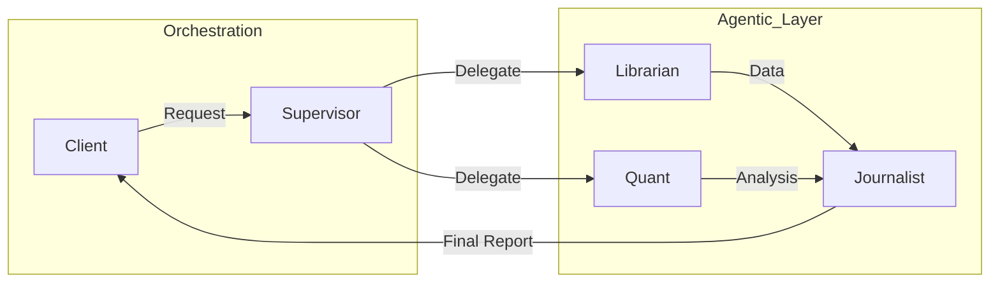

  

  

  

    
    
    
  

---

### 🚀 Engineering Philosophy
> "Building intelligent systems that scale, not just scripts that run."

I am a **Computer Science Engineer** specializing in **Artificial Intelligence** and **Machine Learning**. My work focuses on bridging the gap between research and production—architecting robust **Multi-Agent Systems**, optimizing **LLM Inference**, and building **Scalable Backend Infrastructure** for AI applications.

*   **Current Focus:** Agentic Orchestration & Distributed AI Systems.
*   **Goal:** Contributing to high-impact Open Source projects (GSoC '26) like **LangChain**, **TensorFlow**, or **NumFOCUS**.
*   **Core Competency:** Python Performance Optimization, System Design, and Algorithmic Efficiency.

---

### 🛠️ Technical Infrastructure

<table align="center">
  <tr>
    <td align="center" width="33%">
      <b>🧠 AI & Machine Learning</b>  
      
      
      
       
      
      
      
    </td>
    <td align="center" width="33%">
      <b>⚙️ Backend & Orchestration</b>  
      
      
      
       
      
      
      
    </td>
    <td align="center" width="33%">
      <b>💻 Core Engineering</b>  
      
      
      
       
      
      
      
    </td>
  </tr>
</table>

---

### 💎 Signature Engineering

#### 🏗️ [Showcase: AI-Driven Portfolio Engine](https://github.com/HiteshSingh21/Showcase)
> *Automated Portfolio Generation Pipeline*

An enterprise-grade system that ingests raw resume data and orchestrates a generative pipeline to deploy high-fidelity portfolio websites.
*   **Architecture:** Microservices (FastAPI) + Event-Driven Generation.
*   **Tech:** Groq (LLM Inference), PostgreSQL (State Management), Next.js (SSR Frontend).

#### 🤖 [Financial Intelligence Suite (fin-agents)](https://github.com/HiteshSingh21/fin-agents)
> *Autonomous Multi-Agent Market Research System*

A sophisticated **Tri-Agent Architecture** designed to simulate a financial research team.
*   **Design Pattern:** Hierarchical Agent Teams (Supervisor -> Specialized Agents).
*   **Agents:**
    *   `Librarian`: Semantic Search & document retrieval.
    *   `Quant`: Numerical analysis & market data processing.
    *   `Journalist`: Synthesis & report generation.
*   **Stack:** LangGraph, Python 3.11+, Yahoo Finance API.

#### 🎥 [Text-to-Animation Pipeline](https://github.com/HiteshSingh21/text-to-animation)
> *Temporal Consistency Research*

Researching generic consistency in diffusion models to create fluid frame-by-frame animations from textual prompts.

---

### 📊 GitHub Engineering Metrics

  
  

 

  

---

  <i>"I don't just write code; I design systems."</i>

